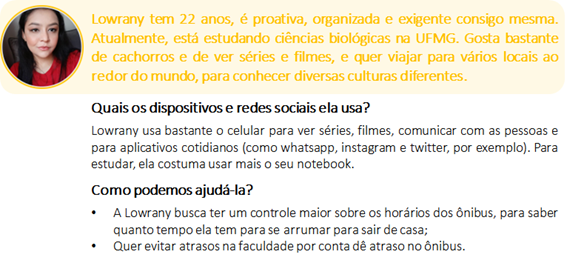
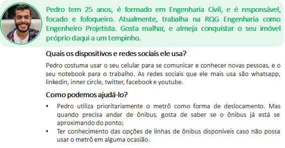
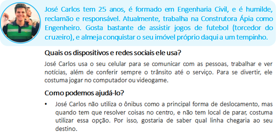
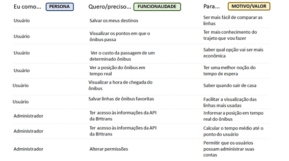
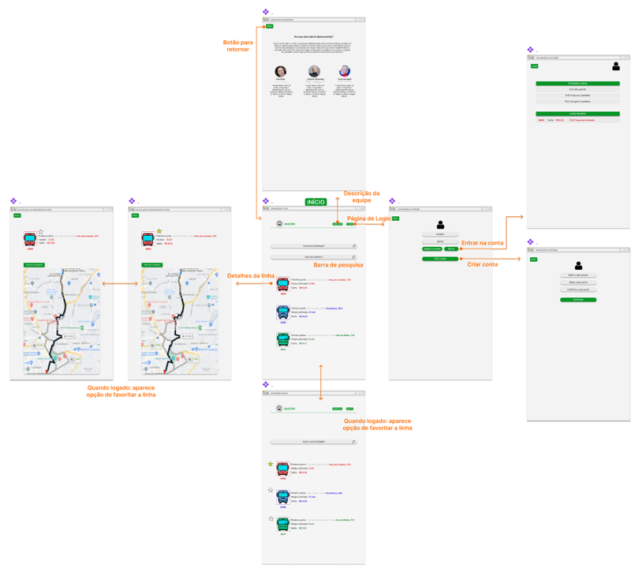
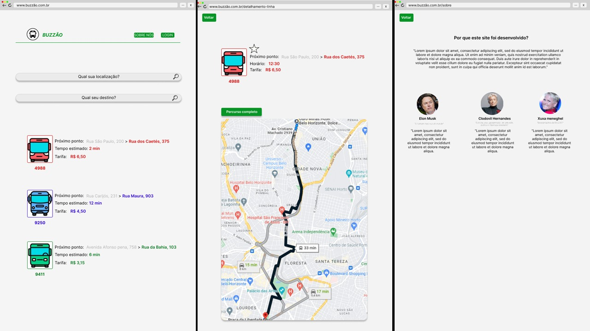
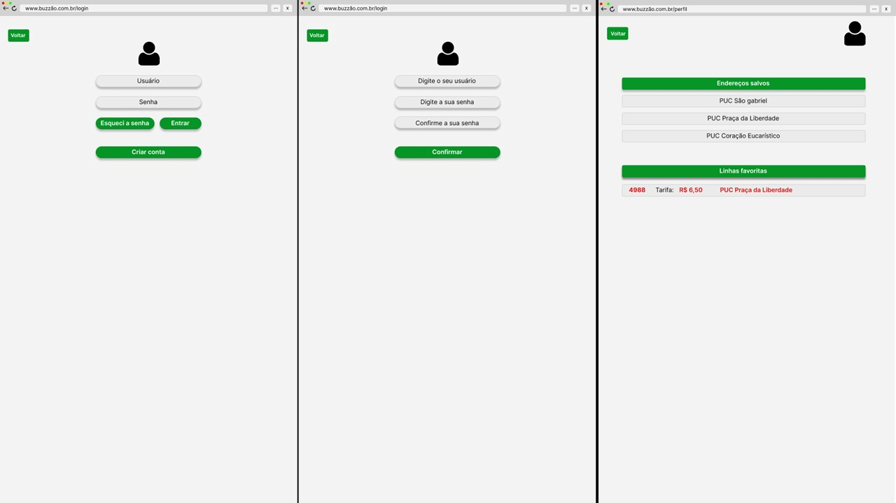
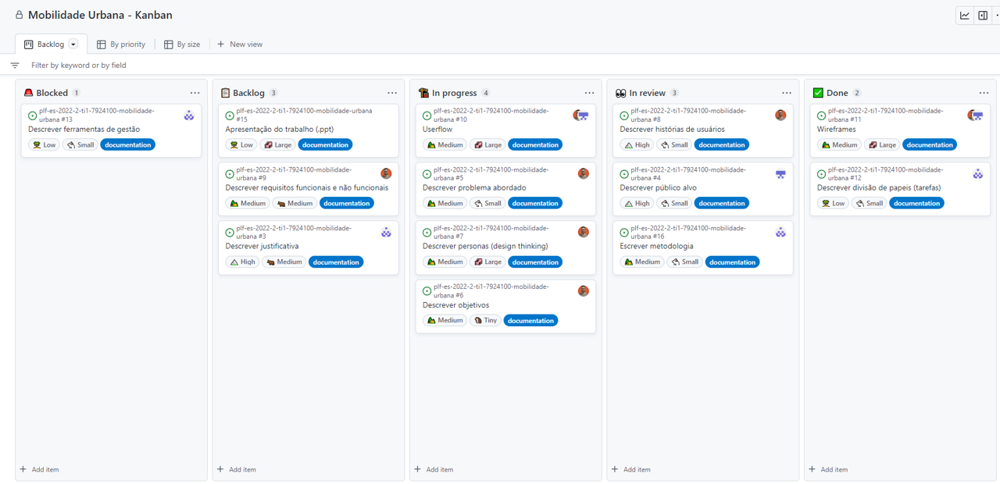

# Informações do Projeto
`TÍTULO DO PROJETO`  
>
>Mobilidade Urbana - Buzzão
>
`CURSO` 
>
> Engenharia de Software - PUC Minas Praça da Liberdade
> 
## Participantes
>
> Equipe envolvida no desenvolvimento do projeto: 
>
> - Guilherme Lage da Costa;
> - Renato Ramalho Teodoro de Oliveira Júnior;
> - Eduardo Vilela de Morais Rodrigues Moreira;
> - Mateus Guanabarino Freire de Castro;
> - Miguel Magalhães Freire de Castro;
> - Arthur Capanema Bretas.
>
# Estrutura do Documento

- [Informações do Projeto](#informações-do-projeto)
  - [Participantes](#participantes)
- [Estrutura do Documento](#estrutura-do-documento)
- [Introdução](#introdução)
  - [Problema](#problema)
  - [Objetivos](#objetivos)
  - [Justificativa](#justificativa)
  - [Público-Alvo](#público-alvo)
- [Especificações do Projeto](#especificações-do-projeto)
  - [Personas e Mapas de Empatia](#personas-e-mapas-de-empatia)
  - [Histórias de Usuários](#histórias-de-usuários)
  - [Requisitos](#requisitos)
    - [Requisitos Funcionais](#requisitos-funcionais)
    - [Requisitos não Funcionais](#requisitos-não-funcionais)
  - [Restrições](#restrições)
- [Projeto de Interface](#projeto-de-interface)
  - [User Flow](#user-flow)
  - [Wireframes](#wireframes)
- [Metodologia](#metodologia)
  - [Divisão de Papéis](#divisão-de-papéis)
  - [Ferramentas](#ferramentas)
  - [Controle de Versão](#controle-de-versão)
- [**############## SPRINT 1 ACABA AQUI #############**](#-sprint-1-acaba-aqui-)
- [Projeto da Solução](#projeto-da-solução)
  - [Tecnologias Utilizadas](#tecnologias-utilizadas)
  - [Arquitetura da solução](#arquitetura-da-solução)
- [Avaliação da Aplicação](#avaliação-da-aplicação)
  - [Plano de Testes](#plano-de-testes)
  - [Ferramentas de Testes (Opcional)](#ferramentas-de-testes-opcional)
  - [Registros de Testes](#registros-de-testes)
- [Referências](#referências)

# Introdução

## Problema
>
>A utilização do meio de transporte público como principal forma de deslocamento é a realidade de grande parte da população brasileira. Em que pese a sua relevância, os seus usuários são frequentemente surpreendidos por atrasos nas linhas, alteração do horário do ônibus, ou até mesmo desconhecimento de uma opção de linha mais viável. Esses eventos, imprevistos, causam diversos impactos ao planejamento das pessoas, como:
>
> - Atraso para os seus compromissos;
> - Tempo de deslocamento incerto;
> - Custo adicional com tarifas, caso haja uma opção mais barata.
>
>Partindo desse pressuposto, seria possível fornecer a essas pessoas uma informação clara e precisa sobre as linhas de ônibus que elas poderiam usar, para chegarem da maneira mais rápida e econômica ao seu destino? Essa é uma dor presente no dia a dia de muitas pessoas que dependem dessas informações para se planejarem, e que será analisada e desenvolvida no projeto a seguir.
>
## Objetivos

### Objetivo geral
>
>O objetivo geral deste projeto, é desenvolver uma plataforma web que ajude os usuários a terem um maior controle das opções de ônibus disponíveis para chegarem  às suas localizações desejadas de forma dinâmica e objetiva.
>
### Objetivos específicos
>
> - Apresentar de maneira simples e prática as linhas de ônibus para o destino do usuário;
> - Demonstrar os horários em que cada uma das linhas passam em um determinado ponto;
> - Comparar as linhas disponíveis, avaliando qual seria a opção mais viável.
>
## Justificativa
>
>Segundo o IPEA (Instituto de pesquisa econômica aplicada), 65% da população brasileira utiliza o transporte público como principal forma de deslocamento nas capitais. Em pesquisas realizadas pelo instituto, verificou-se que mais de 90% dos passageiros consideram que andam em ônibus lotados e esperam mais de 30 minutos nos pontos de ônibus, uma vez que os horários muitas vezes não são respeitados.
>
>Em pesquisa realizada pela própria equipe do projeto, avaliamos um grupo composto em 88,6% por jovens de 18 a 30 anos, sendo que 68% são pessoas que utilizam o ônibus como principal meio de transporte. Visando auxiliar os usuários que andam de ônibus diariamente, o projeto em questão busca fornecer melhores rotas, informações acerca das linhas de ônibus e controle dos horários, para os usuários que buscam maior praticidade no momento de deslocamento de sua residência ao local desejado.
>
## Público-Alvo
>
>Com base nos dados apresentados no capítulo de Justificativa, o publico alvo do presente estudo serão homens e mulheres, com faixa etária de 18 a 30 anos, que residem em Belo Horizonte e utilizam o ônibus como o principal meio de transporte, e que possuem familiaridade com aplicativos e sites.
> 
# Especificações do Projeto
>
>Nesta seção, será apresentada uma visão mais detalhada e aprofundada do projeto em análise. Para isso, foram utilizadas das seguintes práticas:
> - Descrição de Personas: busca entender, em uma visão mais pessoal, as dores das pessoas relacionadas com o tema do estudo;
> - Histórias de usuários: indicação, na visão de usuários e administradores da plataforma, das funcionalidades/capacidades esperadas que podem lhe ajudar;  
> - Requisitos: quais são nossas 'exigências' em termos de funcionalidades da plataforma (requisitos funcionais) e demais aspectos (requisitos não funcionais); 
> - Restrições: definição dos limites do projeto.
>
## Personas e Mapas de Empatia
>
>Para um maior conhecimento acerca das pessoas que buscamos atingir e ajudar com esse projeto, foram realizadas entrevistas com 5 pessoas de diferentes áreas e grupos. Esses grupos variam desde estudantes, pessoas que estão estudando e estagiando simultaneamente, e pessoas que já se formaram, e estão inseridas no mercado de trabalho.
>
>Ademais, cabe mencionar que as entrevistas contemplaram pessoas que não necessariamente utilizam o ônibus como forma principal de deslocamento em seu dia a dia, mas que, em eventuais situações, fazem uso deste meio de transporte, como é o caso do Pedro e José Carlos. Considerando essas informações, a seguir são apresentadas as Personas mapeadas.
>
>**Lowrany Ferreira:**
>
> 
>
>**Beane do Carmo:**
>
> 
>
>**Tamara Andrade:**
>
> 
>
>**Pedro Guerra:**
>
> 
>
>**José Carlos:**
>
> 
>
## Histórias de Usuários

>Com base na análise das personas apresentadas acima, foram identificadas as seguintes histórias de usuários:
>
>
>
## Requisitos
>
>Com base nas pesquisas realizadas pela equipe, foram mapeados os principais requisitos (funcionais e não funcionais) detalham o escopo do projeto.
>
### Requisitos Funcionais
>
|ID    | Descrição do Requisito  | Prioridade |
|------|-----------------------------------------|----|
|RF-001| Permitir que o usuário salve os seus destinos | ALTA | 
|RF-002| Mostrar a posição do ônibus em tempo real   | ALTA |
|RF-003| Apresentar o horário de chegada esperado do ônibus | ALTA |
|RF-004| Apresentar os pontos nos quais o ônibus irá passar | MÉDIA |
|RF-005| Ter uma página com todas as informações de uma determinada linha específica | MÉDIA |
|RF-006| Ter uma página para o usuário ver os seus destinos salvos | MÉDIA |
|RF-007| Ver o custo para realizar o trajeto (com base na tarifa do ônibus) | MÉDIA |
|RF-008| Indicar qual seria a melhor linha, considerando o tempo médio e custo previsto | BAIXA |
|RF-009| Conceder informações sobre a ocupação dos ônibus | BAIXA |
|RF-010| Alertar o usuário quando o seu ônibus estiver atrasado  | BAIXA |
>
### Requisitos não Funcionais
>
|ID     | Descrição do Requisito  |Prioridade |
|-------|-------------------------|----|
|RNF-001| Deve conseguir acessar as informações da API do BHtrans e MapBox | ALTA | 
|RNF-002| O usuário deve ser capaz de encontrar opções de ônibus com menos de 5 cliques | ALTA | 
|RNF-003| A opção de favoritar linhas e endeços deve ser indicada no momento de pesquisa do usuário | ALTA | 
|RNF-004| O sistema precisa ser executado tanto em desktops quanto dispositivos móveis | MÉDIA | 
|RNF-005| O tempo para apresentação da linha do ônibus não pode ser superior a 5 segundos | MÉDIA | 
|RNF-006| A interface deve possuir uma opção de layout claro e escuro  | BAIXA | 
> 
## Restrições
>
>O projeto em análise será restrito pelos itens apresentados conforme tabela a seguir.
>
|ID| Restrição                                             |
|--|-------------------------------------------------------|
|01| O projeto deverá ser entregue até o final do semestre |
|02| Não pode ser desenvolvido um módulo de back-end |
|03| Não podem ser feitos aportes financeiros no projeto |
>
# Projeto de Interface
>
>Pensando em uma forma mais dinâmica de se utilizar o sistema projetado e na praticidade necesária, foi desenhada uma interface com um conceito 'clean'. Ou seja, são necessários poucos cliques para que o usuário consiga a informação que deseja. A principal razão para isso são os cenários nos quais o usuário pode utilizar o Buzzão, seja enquanto se arruma para sair de casa ou enquanto anda na rua, por exemplo. 
>
>Neste sentido, a seguir são detalhados o userflow do site e os wireframes projetados.
>
## User Flow
>
>A seguir é detalhado o user flow elaborado para o projeto, considerando as premissas acima informadas.
>
>
>
>Para uma melhor visualização, este fluxo pode ser acessado por meio do seguinte [link](https://www.figma.com/file/wVv0JaD1McTy8OgkEo2D4Z/Buzz%C3%A3o---User-flow?node-id=0%3A1).
>
## Wireframes
>
>A seguir é detalhado os wireframes elaborados para o projeto.
>
>**Página inicial, detalhamento e sobre:** 
>
>
>
>**Página de login, criação de usuário e perfil:** 
>
>
>
>Para uma melhor visualização, o protótipo interativo da página pode ser acessado pelo seguinte [link](https://www.figma.com/proto/cZuvPXMTUubx1HkE5WLvpg/Buzz%C3%A3o---Wireframes?node-id=17%3A63&scaling=min-zoom&page-id=0%3A1&starting-point-node-id=17%3A63).
>
# Metodologia
>
>A equipe utilizou o Design Thinking em todo o processo de entendimento do problema. Por meio dele, foi possível definir o objetivo, os mapas de personas e as histórias de usuários. Além disso, foram utilizadas diversas práticas do scrum, como reuniões diárias, divisão do grupo por funções, ficando a cargo de cada integrante a seleção das tarefas que ele iria realizar. Utilizamos também um fluxo de revisão, no qual cada integrante do grupo revisou o que foi feito pelos demais componentes.Além do método kanban para realização de atividades, dessa forma o grupo visualizava as atividades mais urgentes e as atividades que demandavam mais tempo e dedicação, esse método contribuiu diretamente para a realização do projeto.
>
>De modo a fornecer uma visão mais detalhada dos processos realizados pela equipe, apresenta-se a seguir os capítulos de 'divisão de papéis' e 'ferramentas'.
>
## Divisão de Papéis
>
>A tabela a seguir demonstra a equipe integrante do projeto e suas respectivas funções.
>
| Membro   | Função   |
| -------- | -------- |
| Guilherme Lage | Desenvolvedor e Scrum Master |
| Renato Ramalho | Desenvolvedor |
| Eduardo Vilela | Desenvolvedor |
| Miguel Magalhães | Desenvolvedor |
| Mateus Guanabarino | Desenvolvedor |
| Arthur Capanema | Desenvolvedor |
| Felipe Augusto | Product owner |
| Roberto Felipe | Product owner |
| Rommel Vieira  | Product owner |
>
>Conforme supramencionado, para realizar a divisão das atividades entre a equipe, adotamos a metodologia Kanban, em que cada um dos componentes escolhe as atividades que deseja fazer. A figura a seguir ilustra a divisão de tarefas do projeto, que pode ser consultado por meio deste [link](https://github.com/orgs/ICEI-PUC-Minas-PPLES-TI/projects/76/views/1).
>
>Para fins de acompanhamento, definimos as atividades foram agrupadas nas seguintes categorias: (i) blocked; (ii) backlog; (iii) in process; (iv) in review; e (v) done, cada uma com suas características, sendo elas:
>  - 🚨 Blocked: atividades que dependem de outras e que não podem ser feitas no momento;
>  - 📋 Backlog: são as atividades que serão desenvolvidas ao longo da sprint;
>  - 🏗 In progress: atividades em andamento pela equipe;
>  - 👀 In review: categoria composta pelas atividades finalizadas, mas que estão no processo de revisão;
>  - ✅ Done: atividades concluídas e revisadas, prontas para entrega;
>  - 🗑 Canceled: atividades canceladas (categoria criada para fins de controle geral).
>
>
>
## Ferramentas
>
>As ferramentas utilizadas no ao longo do processo foram:
>
| Ambiente  | Plataforma              |Link de Acesso |
|-----------|-------------------------|---------------|
|Processo de Design Thinking | Miro | [Desing Thinking](https://miro.com/app/board/uXjVPXxT7Fw=/) | 
|Repositório online | GitHub | [Repositorio Github](https://github.com/ICEI-PUC-Minas-PPLES-TI/plf-es-2022-2-ti1-7924100-mobilidade-urbana) |  
|Controle de versões | Git |[Git](https://git-scm.com/) |
|Acompanhamento das atividades - Kanban| GitHub Projects | [Kanban](https://github.com/orgs/ICEI-PUC-Minas-PPLES-TI/projects/76/views/1) |
|Protótipo Interativo - Wireframe | Figma | [Wireframe](https://www.figma.com/proto/cZuvPXMTUubx1HkE5WLvpg/Mobilidade-Urbana---Wireframes?node-id=17%3A1485&scaling=min-zoom&page-id=0%3A1&starting-point-node-id=17%3A63) | 
|Protótipo Interativo - Userflow | Figma | [Userflow](https://www.figma.com/file/fU3Vj6kHDgNxbCayeD29Dz/Mobilidade-Urbana---User-Flow?node-id=0%3A1) | 
|Comunicação | Discord e Whatsapp |
|Editor de código | Visual Studio Code |
> 
>As ferramentas listadas foram utilizadas por conta de sua praticidade na utilização e reconhecimento no mercado.
>
# **############## SPRINT 1 ACABA AQUI #############**

# Projeto da Solução

......  COLOQUE AQUI O SEU TEXTO ......

## Tecnologias Utilizadas

......  COLOQUE AQUI O SEU TEXTO ......

> Descreva aqui qual(is) tecnologias você vai usar para resolver o seu
> problema, ou seja, implementar a sua solução. Liste todas as
> tecnologias envolvidas, linguagens a serem utilizadas, serviços web,
> frameworks, bibliotecas, IDEs de desenvolvimento, e ferramentas.
> Apresente também uma figura explicando como as tecnologias estão
> relacionadas ou como uma interação do usuário com o sistema vai ser
> conduzida, por onde ela passa até retornar uma resposta ao usuário.
> 
> Inclua os diagramas de User Flow, esboços criados pelo grupo
> (stoyboards), além dos protótipos de telas (wireframes). Descreva cada
> item textualmente comentando e complementando o que está apresentado
> nas imagens.

## Arquitetura da solução

......  COLOQUE AQUI O SEU TEXTO E O DIAGRAMA DE ARQUITETURA .......

> Inclua um diagrama da solução e descreva os módulos e as tecnologias
> que fazem parte da solução. Discorra sobre o diagrama.
> 
> **Exemplo do diagrama de Arquitetura**:
> 
> 

# Avaliação da Aplicação

......  COLOQUE AQUI O SEU TEXTO ......

> Apresente os cenários de testes utilizados na realização dos testes da
> sua aplicação. Escolha cenários de testes que demonstrem os requisitos
> sendo satisfeitos.

## Plano de Testes

......  COLOQUE AQUI O SEU TEXTO ......

> Enumere quais cenários de testes foram selecionados para teste. Neste
> tópico o grupo deve detalhar quais funcionalidades avaliadas, o grupo
> de usuários que foi escolhido para participar do teste e as
> ferramentas utilizadas.
> 
> **Links Úteis**:
> - [IBM - Criação e Geração de Planos de Teste](https://www.ibm.com/developerworks/br/local/rational/criacao_geracao_planos_testes_software/index.html)
> - [Práticas e Técnicas de Testes Ágeis](http://assiste.serpro.gov.br/serproagil/Apresenta/slides.pdf)
> -  [Teste de Software: Conceitos e tipos de testes](https://blog.onedaytesting.com.br/teste-de-software/)

## Ferramentas de Testes (Opcional)

......  COLOQUE AQUI O SEU TEXTO ......

> Comente sobre as ferramentas de testes utilizadas.
> 
> **Links Úteis**:
> - [Ferramentas de Test para Java Script](https://geekflare.com/javascript-unit-testing/)
> - [UX Tools](https://uxdesign.cc/ux-user-research-and-user-testing-tools-2d339d379dc7)

## Registros de Testes

......  COLOQUE AQUI O SEU TEXTO ......

> Discorra sobre os resultados do teste. Ressaltando pontos fortes e
> fracos identificados na solução. Comente como o grupo pretende atacar
> esses pontos nas próximas iterações. Apresente as falhas detectadas e
> as melhorias geradas a partir dos resultados obtidos nos testes.

# Referências

......  COLOQUE AQUI O SEU TEXTO ......

> Inclua todas as referências (livros, artigos, sites, etc) utilizados
> no desenvolvimento do trabalho.
> 
> **Links Úteis**:
> - [Formato ABNT](https://www.normastecnicas.com/abnt/trabalhos-academicos/referencias/)
> - [Referências Bibliográficas da ABNT](https://comunidade.rockcontent.com/referencia-bibliografica-abnt/)
